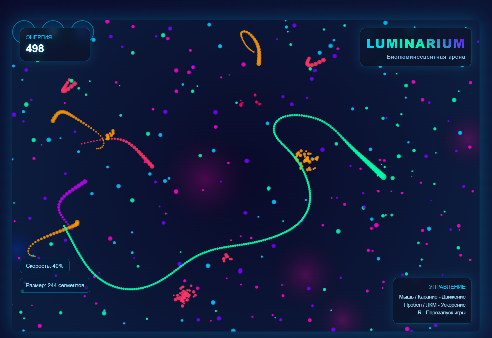

# LUMINARIUM — Биолюминесцентная арена



**LUMINARIUM** — это интерактивная браузерная игра в стиле "биолюминесцентной арены", где вы управляете светящимся существом, поглощающим энергию и избегаете столкновений с врагами. Игра написана на чистом HTML, CSS и JavaScript без сторонних библиотек.

---

## 🎮 Как играть

1. **Наведите курсор** или коснитесь экрана, чтобы двигаться.  
2. **Пробел / ЛКМ** — ускорение (требует энергии).  
3. **R** — перезапустить игру в любой момент.  
4. **Цель** — собирать светящиеся частицы, расти и избегать столкновений с врагами.

> 💡 Игра начинается при первом клике.

---

## 🚀 Особенности

- 🌌 Плавная анимация с `requestAnimationFrame`  
- 🎨 Эффекты свечения и пульсации с Canvas  
- 🌀 Динамические враги с простым ИИ  
- ⚡ Эффекты поглощения и взрыва  
- 📱 Полная адаптивность (поддержка мобильных устройств)  
- 🎵 Без внешних зависимостей — работает оффлайн

---

## 🖼️ Скриншот


> *Светящееся существо движется по тёмной арене, поглощая энергию и избегая врагов.*

---

## 📦 Запуск локально

1. Скачайте или клонируйте репозиторий:  
   ```bash
   git clone <URL вашего репозитория>
